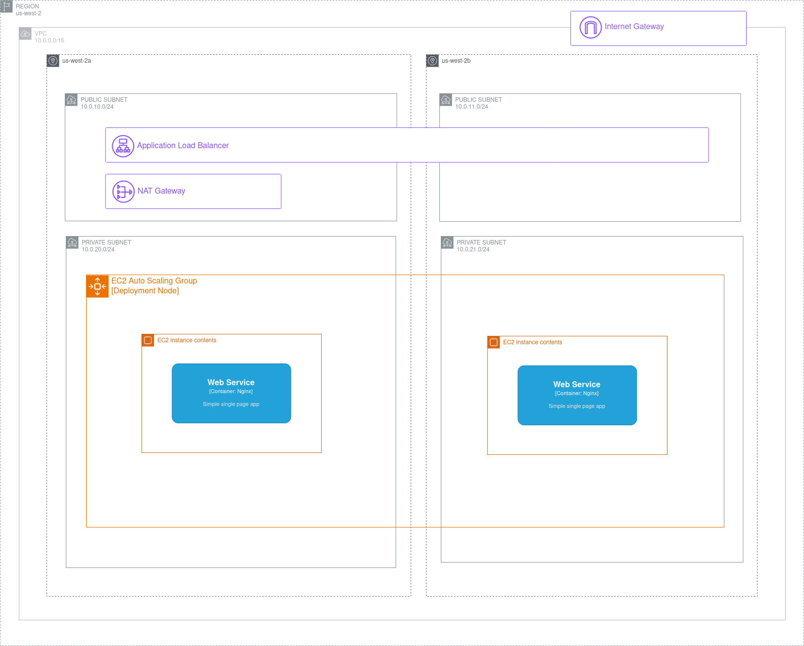

# Documentation
This contains basic info to dpeloy and access the app.

## Thought Process
- AWS ec2 with auto-scaling group and alb was the first infra that came to mind so i ran with that.
- I like to include arch diagrams where possible and lean towards C4 as a digramming standard
- I've already completed the old version of this question so just included that as a baseline.
- Would have liked to explore similar solution wit ansible or a hybrid just ran out of time.
- NOTE: This may not be working maybe typo in the user_data.sh script (ran out of time).

## Requirements
- Terraform
- Github PAT tocken with access to repo

## Usage
1. Create a terraform.tfvars file for your deployment and save as infra/terraform.tfvars
```
GITHUB_REPO = "<github repo>"
GITHUB_BRANCH = "<branch to deploy>"
GITHUB_USER = "<github user auth'ed to use token>"
GITHUB_TOKEN = "<github pat token for simple deployment>"
```

2. run terraform plan to evaluate changes
```
terraform plan
```

3. run terraform apply to apply and deploy changes
```
teraform apply
```

4. Output will show `alb_endpoint = <>` to access the app

5. run terraform destroy to destroy infra.
```
teraform destroy
```


## Architectire




